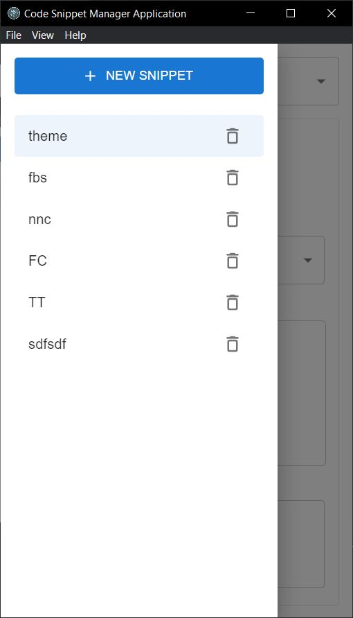

# Code Snippet Manager Application
This application allows users to create and update and delete snippets and show code snippets with syntax highlighting based on their language.

## Version

1.0.0

## Design Decisions

I started from `Electron React boilerplate` which is a great template for `Electron + React`. \
To complete tasks, I considered state management and storage for persistence data (here that is code snippets). I chose `Context API` and `electron-store` for this. \
To improve the UI/UX, here `MUI` was used as styling theme which can help me to build responsive UIs. \
Finally I chose `React-Syntax-Highlighter` for `Syntax highlighting`.

I organized our `React components` in a modular structure to promote code reusability and maintainability. Each component has a clear responsibility and can be easily extended or replaced as needed. \
I followed the standard `Electron architecture`, separating the main process responsible for system-level operations and the renderer process for rendering the user interface. \
And also I utilize `Electron's Inter-Process Communication (IPC) mechanism` for communication between the main process and renderer process. \
For testing, I chose `Jest` as our test runner along with `React Testing Library`. I added one unit-testing file here for your reference.

## Key Features

- Syntax highlighting for various programming languages.
- Implement CRUD(Create, Read, Update, Delete) actions for code snippets.
- Allow users to search snippets by their title or description.
- Save code snippets in local storage.

## Overview

   

  
  

## Installation

- Run `yarn` or `npm i`
- Run `yarn start` or `npm start` for the local environment
- Run `yarn build` or `npm run package` for the production environment

 

# Tech Stacks

Desktop app framework: Electron

UI: ReactJS

Styling: MaterialUI

Syntax Highlighter: React-Syntax-Highlighter

State Management: Context API

Form Management: react-hook-form and yup resolver

Local Data Persistance: Electron-Store

Testing: Jest

 

# Duration:

One man-day

 

# Project Description and tasks implementation check:

Design and implement a code snippet manager application using Electron, React and TypeScript.

- Main Window:

  &#9745; Display a list of code snippets in sidebar.

  &#9745; Allow users to create new snippets, edit existing snippets, and delete snippets.

  &#9745; Implement search functionality to search for snippets by title and description.

- Code Snippet Entry:

  &#9745; Each snippet have a title, description, language type and code snippet itself.

  &#9745; Implement code highlighter component to highlight code snippets based on their languages.

- Persistence and Storage:

  &#9745; Use electron store or database to keep the code snippets in local storage.
